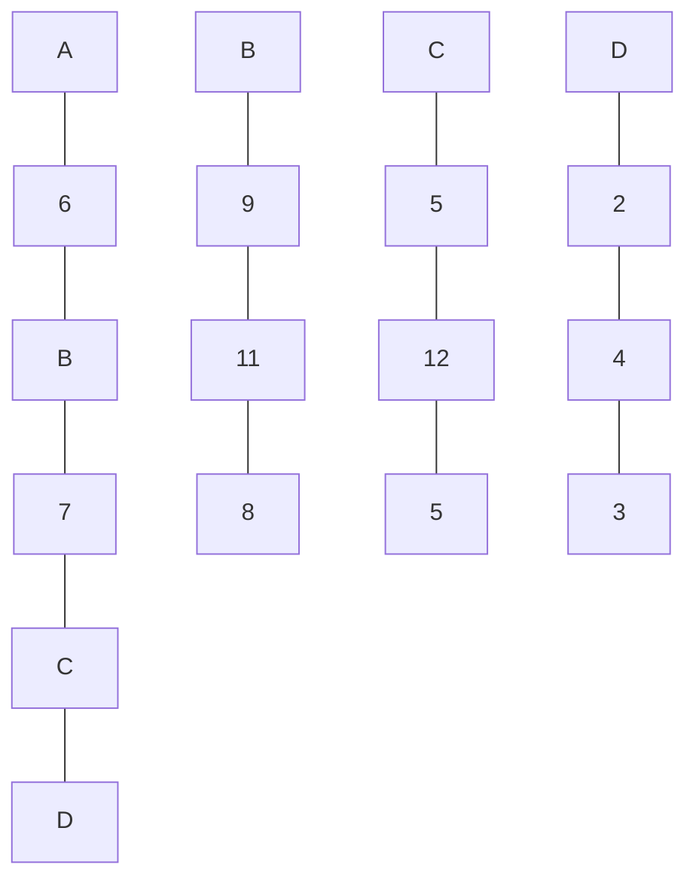

# Uma questão de equilíbrio

Você está envolvido em um ousado projeto de arquitetura que planeja construir um monumento no centro de Porto Alegre. O monumento ficará em pé apenas por causa da gravidade e foi construído para manter um equilíbrio muito delicado. Por isso você deve fazer os cálculos da estrutura e confirmar que ela está perfeitamente balanceada.

Um exemplo de monumento está na figura abaixo, onde cada parte da estrutura tem um nome, e os números indicam os pesos que são colocados em cada ponto da estrutura.



## Descrição da estrutura

Uma série de exemplos devem ser lidos de arquivos e avaliados.

Para começar, você tem as seguintes informações sobre o monumento a ser construído:

- Cada parte da estrutura tem um nome e um número ímpar de **“pontos de encaixe”** para colocar outras partes acima dela. Os pontos de encaixe de uma parte da estrutura estão sempre à mesma distância uns dos outros.
- A descrição da estrutura é feita fornecendo-se o número de partes da estrutura, o nome de cada parte, depois o número de pontos de encaixe que esta parte tem, e o que deve ser colocado em cada encaixe.

Por exemplo, a descrição da estrutura acima é mostrada a seguir (podem haver outras maneiras de descrever a mesma estrutura!):

```text
4
A 5 6 B 7 C D
B 3 9 11 8
C 3 5 12 5
D 3 2 4 3
```

Depois de ler os dados e analisar o monumento, você deve emitir um relatório informando que partes da estrutura estão em equilíbrio e que partes não estão.

Para o exemplo acima, você vai constatar que as partes **A** e **C** estão em equilíbrio, mas **B** e **D** não estão.
